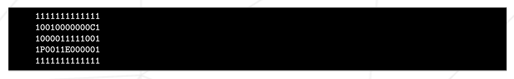
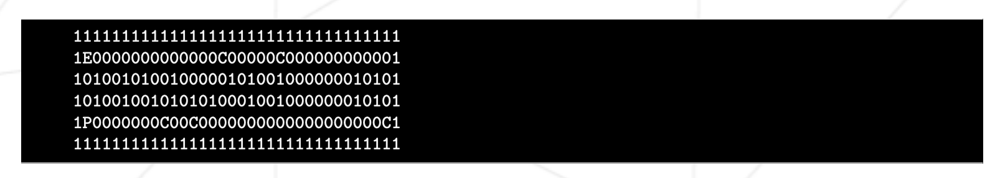

# so_long
Простая 2D игра на библиотеке mlx, в которой дельфин сбегает с Земли после поедания рыбы.

Название программы: `so_long`
Разрешенные файлы: Makefile, *.h, *.c, maps
Makefile: NAME, all, clean, fclean, re
Разрешенные функции: 	- open, close, read, write,
						malloc, free, perror,
						strerror, exit
						- все функции библиотеки math
						(-lm compiler option, man man 3 math)
						- все функции библиотеки MiniLibX
						- свои функции из библиотеки libft

Программа принимае как параметр файл `.ber`

## Правила игры

Цель игрока собрать все предметы на карте и выбраться самым коротким путём.
Игрок перемещается по карте с помощью `W`, `A`, `S`, `D`.
Игрок должен иметь возможность двигаться в 4 направлениях: вверх, вниз, влево, вправо.
Игрок не может передвигаться через стены.
При каждом движении должно отображаться текущее количество перемещений.
Использовать 2D вид.
Игра не должна быть в реальном времени.

## Графика

Программа должна отображаться в окне.
Управление окном должно сохраняться (переход в другое окно, свертывание и т.д.).
Нажатие ESC должно закрывать окно и делать выход из программы.
Нажатие крестик окна должно закрывать окно и делать выход из программы.

## Карта

Карта должна быть построена из 3 компонентов: стены, предметы и свободное пространство.
Карта может состоять только из этих 5 символов:
- `0` обозначает пустое место,
- `1` - стена,
- `C` - предмет коллекционирования,
- `E` - выход,
- `P` - стартовая позиция игрока.

Пример простой валидной карты:

На карте должны быть минимум 1 выход, 1 предмет коллекционирования и 1 стартовая позиция игрока.

Карта должна быть прямоугольной.

Карта должны быть окружена стенами. Если это не так программа должны вернуть ошибку.

Не нужно проверять наличие валидного пути для выхода.

Ещё пример карты .ber:

Если в файле обнаружена какая-либо неправильная конфигурация любого рода, программа должна завершиться корректно и вернуть «Error\n», за которым следует явное сообщение об ошибке по вашему выбору.

## Бонусная часть

- Игрок должен проиграть, когда касается врага.
- Добавить анимации спрайтов.
- Отображать количество движений прямо на экране, а не записывать его в оболочке.